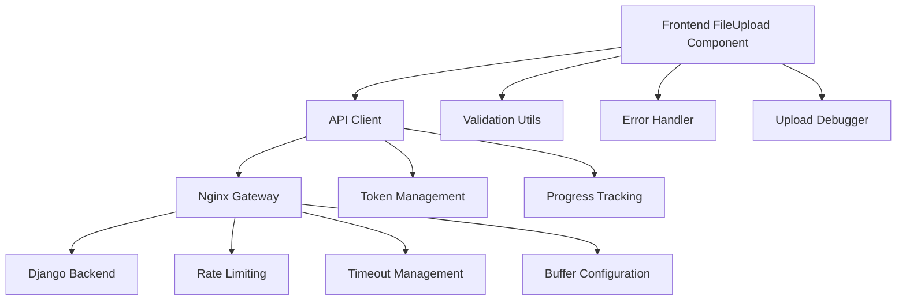

# File Upload Enhancement Design

## Overview

The file upload enhancement addresses critical inconsistencies and reliability issues in the current upload system. The design focuses on creating a unified, robust file upload experience with proper error handling, progress tracking, and consistent validation across all system components.

## Architecture

### System Components



### Data Flow

1. **File Selection**: User selects file via drag-drop or file picker
2. **Client Validation**: Frontend validates file size, type, and extension
3. **Upload Initiation**: FormData created and sent via API client
4. **Nginx Processing**: Gateway handles routing with extended timeouts
5. **Backend Processing**: Django processes and stores the file
6. **Progress Updates**: Real-time progress feedback to user
7. **Completion**: Success/error feedback with detailed information

## Components and Interfaces

### Enhanced FileUpload Component

**Location**: `frontend/src/components/common/FileUpload.tsx`

**Key Features**:
- Drag-and-drop interface with visual feedback
- Real-time file validation
- Upload progress display
- Enhanced error messaging
- File size formatting utilities

**Props Interface**:
```typescript
interface FileUploadProps {
    onFileSelect: (file: File) => void;
    accept?: string;
    maxSize?: number;
    isLoading?: boolean;
    label?: string;
    error?: string;
    allowedTypes?: string[];
    showProgress?: boolean;
    uploadProgress?: number;
}
```

### API Client Enhancements

**Location**: `frontend/src/api/documentsApi.ts`

**Key Improvements**:
- Automatic Content-Type handling for FormData
- Extended timeout configuration (5 minutes)
- Upload progress tracking
- Proper error propagation

**Upload Configuration**:
```typescript
{
    timeout: 300000, // 5 minutes
    onUploadProgress: (progressEvent) => {
        // Progress tracking implementation
    }
}
```

### Validation System

**Location**: `frontend/src/utils/validationUtils.ts`

**Validation Rules**:
- File size: Maximum 50MB
- File types: PDF, PNG, JPG, JPEG, TIFF
- File extensions: .pdf, .png, .jpg, .jpeg, .tiff
- Empty file detection

### Error Handling System

**Location**: `frontend/src/utils/errorHandler.ts`

**Error Categories**:
- File validation errors
- Network timeout errors
- Server response errors (413, 422, 500)
- Authentication errors

**Error Display Strategy**:
- Upload errors: 8-second display duration
- Standard errors: 5-second display duration
- Visual indicators with icons and colored borders

### Nginx Configuration

**Location**: `nginx/conf.d/default.conf`

**Upload-Specific Settings**:
```nginx
location /api/documents/ {
    client_max_body_size 50M;
    client_body_buffer_size 1M;
    client_body_timeout 300s;
    
    proxy_connect_timeout 120s;
    proxy_send_timeout 300s;
    proxy_read_timeout 300s;
    
    proxy_request_buffering off;
    proxy_buffering off;
}
```

## Data Models

### File Upload Data Structure

```typescript
interface DocumentUploadData {
    file: File;
    doc_type: DocumentType;
    title?: string;
}

interface DocumentUploadResponse {
    message: string;
    document: Document;
}
```

### Validation Result Structure

```typescript
interface ValidationResult {
    isValid: boolean;
    error?: string;
}

interface UploadTestResult {
    success: boolean;
    error?: string;
    details?: any;
    timing?: {
        start: number;
        end: number;
        duration: number;
    };
}
```

## Error Handling

### Error Classification

1. **Client-Side Validation Errors**
   - File size exceeds limit
   - Invalid file type
   - Invalid file extension
   - Empty file

2. **Network Errors**
   - Connection timeout
   - Network unavailable
   - DNS resolution failure

3. **Server Errors**
   - 413 Payload Too Large
   - 422 Unprocessable Entity
   - 500 Internal Server Error
   - Authentication failures

### Error Recovery Strategies

- **Validation Errors**: Immediate feedback with correction guidance
- **Network Errors**: Retry suggestion with timeout information
- **Server Errors**: Specific error messages with troubleshooting steps
- **Authentication Errors**: Automatic token refresh where possible

## Testing Strategy

### Unit Testing

1. **File Validation Tests**
   - Test file size validation
   - Test file type validation
   - Test file extension validation
   - Test empty file detection

2. **Component Tests**
   - Test drag-and-drop functionality
   - Test file selection
   - Test progress display
   - Test error display

3. **API Client Tests**
   - Test FormData creation
   - Test timeout handling
   - Test progress tracking
   - Test error handling

### Integration Testing

1. **End-to-End Upload Tests**
   - Test complete upload flow
   - Test large file uploads
   - Test error scenarios
   - Test progress tracking

2. **Network Configuration Tests**
   - Test nginx timeout handling
   - Test rate limiting
   - Test buffer configuration
   - Test error responses

### Debug Testing

1. **Upload Diagnostics**
   - Endpoint connectivity testing
   - File validation testing
   - System information logging
   - Performance timing analysis

## Performance Considerations

### Upload Optimization

- **Streaming**: Nginx streams uploads directly to backend without buffering
- **Timeouts**: Extended timeouts prevent premature failures
- **Progress**: Real-time progress updates improve user experience
- **Validation**: Client-side validation reduces server load

### Resource Management

- **Memory**: Avoid loading large files into memory
- **Network**: Efficient use of connection pooling
- **Storage**: Proper cleanup of temporary files
- **Caching**: Appropriate cache headers for upload endpoints

## Security Considerations

### File Validation

- **Double Validation**: Both MIME type and file extension checking
- **Size Limits**: Strict enforcement of file size limits
- **Type Restrictions**: Limited to business-required file types
- **Content Scanning**: Backend validation of file contents

### Network Security

- **Rate Limiting**: Protection against upload abuse
- **Authentication**: Proper token validation
- **HTTPS**: Secure transmission of file data
- **Input Sanitization**: Proper handling of file metadata

## Monitoring and Debugging

### Debug Utilities

**Location**: `frontend/src/utils/uploadDebugger.ts`

**Capabilities**:
- Comprehensive upload testing
- Network connectivity verification
- System information collection
- Performance timing analysis

**Usage**:
```javascript
// Browser console debugging
uploadDebugger.runUploadDiagnostics();
uploadDebugger.testFileUpload(file);
uploadDebugger.logSystemInfo();
```

### Logging Strategy

- **Client-Side**: Console logging for development
- **Server-Side**: Structured logging for production monitoring
- **Network**: Nginx access and error logs
- **Performance**: Timing and resource usage metrics