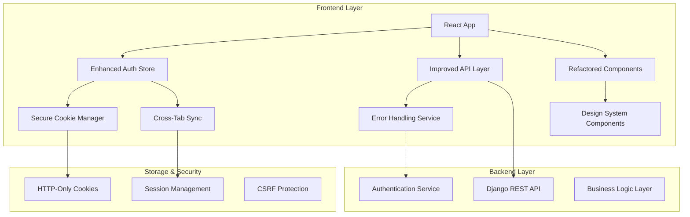

# Design Document

## Overview

This design document outlines the comprehensive refactoring and enhancement of the P2P Procurement System. The system will be transformed from its current state to a production-ready application with secure authentication, improved architecture, enhanced user experience, and robust error handling.

The refactoring focuses on maintaining the existing Django REST Framework backend while significantly improving the React/TypeScript frontend architecture, implementing secure cookie-based authentication, and adding new dashboard features.

## Architecture

### Current Architecture Analysis

The system currently uses:
- **Frontend**: React 18 + TypeScript, Vite, Tailwind CSS, React Query, Zustand
- **Backend**: Django 4.2+ with DRF, PostgreSQL, Celery, Redis
- **Authentication**: JWT tokens stored in client-side cookies
- **State Management**: Zustand for global state, React Query for server state

### Enhanced Architecture Design



## Components and Interfaces

### 1. Enhanced Authentication System

#### Secure Cookie Manager
```typescript
interface SecureCookieManager {
  setAuthTokens(access: string, refresh: string): void;
  getAccessToken(): string | null;
  getRefreshToken(): string | null;
  clearAuthData(): void;
  isTokenValid(token: string): boolean;
}
```

#### Cross-Tab Authentication Sync
```typescript
interface AuthSyncService {
  broadcastAuthEvent(event: AuthEvent): void;
  subscribeToAuthEvents(callback: (event: AuthEvent) => void): () => void;
  handleTabSync(): void;
}

type AuthEvent = 
  | { type: 'LOGIN'; user: User; timestamp: number }
  | { type: 'LOGOUT'; timestamp: number }
  | { type: 'TOKEN_REFRESH'; timestamp: number };
```

### 2. Refactored Component Architecture

#### Base Component Structure
```typescript
interface BaseComponentProps {
  className?: string;
  children?: React.ReactNode;
}

interface LoadingState {
  isLoading: boolean;
  error: string | null;
}
```

#### Enhanced Dashboard Components
```typescript
interface LatestRequestsCardProps {
  requests: PurchaseRequest[];
  isLoading: boolean;
  onRequestClick: (requestId: string) => void;
}

interface DashboardStatsProps {
  userRole: UserRole;
  stats: DashboardStats;
  isLoading: boolean;
}
```

### 3. Improved API Service Layer

#### Enhanced API Client
```typescript
interface APIClient {
  get<T>(url: string, config?: RequestConfig): Promise<T>;
  post<T>(url: string, data?: any, config?: RequestConfig): Promise<T>;
  put<T>(url: string, data?: any, config?: RequestConfig): Promise<T>;
  delete<T>(url: string, config?: RequestConfig): Promise<T>;
}

interface RequestConfig {
  headers?: Record<string, string>;
  timeout?: number;
  retries?: number;
}
```

#### Service Layer Abstraction
```typescript
interface PurchaseRequestService {
  getLatestRequests(limit?: number): Promise<PurchaseRequest[]>;
  getRequestsByStatus(status: RequestStatus): Promise<PurchaseRequest[]>;
  createRequest(data: CreateRequestData): Promise<PurchaseRequest>;
  updateRequest(id: string, data: Partial<CreateRequestData>): Promise<PurchaseRequest>;
}
```

## Data Models

### Enhanced Authentication Models

```typescript
interface AuthState {
  user: User | null;
  isAuthenticated: boolean;
  isLoading: boolean;
  error: string | null;
  lastActivity: number;
}

interface SessionInfo {
  accessToken: string;
  refreshToken: string;
  expiresAt: number;
  user: User;
}
```

### Dashboard Data Models

```typescript
interface DashboardStats {
  totalRequests: number;
  pendingRequests: number;
  approvedRequests: number;
  rejectedRequests: number;
  userSpecificStats: UserRoleStats;
}

interface UserRoleStats {
  staff?: {
    myRequests: number;
    pendingApprovals: number;
  };
  approver?: {
    pendingApprovals: number;
    approvedToday: number;
  };
  finance?: {
    totalPOs: number;
    totalValue: number;
  };
}

interface LatestRequest {
  id: string;
  title: string;
  status: RequestStatus;
  amount: string;
  requester: string;
  createdAt: string;
  urgency?: 'low' | 'medium' | 'high';
}
```

### Error Handling Models

```typescript
interface AppError {
  code: string;
  message: string;
  details?: Record<string, any>;
  timestamp: number;
  context?: string;
}

interface ErrorBoundaryState {
  hasError: boolean;
  error: Error | null;
  errorInfo: ErrorInfo | null;
}
```

## Error Handling

### Comprehensive Error Management Strategy

#### 1. API Error Handling
- **Network Errors**: Automatic retry with exponential backoff
- **Authentication Errors**: Automatic token refresh and re-authentication
- **Validation Errors**: Field-level error display with user-friendly messages
- **Server Errors**: Graceful degradation with fallback UI

#### 2. Component Error Boundaries
```typescript
class EnhancedErrorBoundary extends React.Component<Props, State> {
  static getDerivedStateFromError(error: Error): State;
  componentDidCatch(error: Error, errorInfo: ErrorInfo): void;
  render(): React.ReactNode;
}
```

#### 3. Loading States and User Feedback
- **Skeleton Loading**: For predictable content layouts
- **Spinner Loading**: For unpredictable operations
- **Progress Indicators**: For multi-step processes
- **Toast Notifications**: For success/error feedback

### Error Recovery Mechanisms

```typescript
interface ErrorRecoveryService {
  retryFailedRequest(requestId: string): Promise<void>;
  refreshAuthenticationState(): Promise<void>;
  clearErrorState(): void;
  reportError(error: AppError): void;
}
```

## Testing Strategy

### 1. Unit Testing
- **Component Testing**: React Testing Library for component behavior
- **Hook Testing**: Custom hooks with proper mocking
- **Service Testing**: API services with mock responses
- **Utility Testing**: Pure functions and helpers

### 2. Integration Testing
- **Authentication Flow**: Login, logout, token refresh
- **API Integration**: Request/response handling
- **Cross-Tab Sync**: Multi-tab authentication scenarios
- **Error Scenarios**: Network failures, invalid responses

### 3. End-to-End Testing
- **User Workflows**: Complete procurement processes
- **Role-Based Access**: Different user role scenarios
- **Dashboard Functionality**: Latest requests, stats display
- **Responsive Design**: Mobile and desktop layouts

## Security Considerations

### 1. Authentication Security
- **HTTP-Only Cookies**: Prevent XSS access to tokens
- **Secure Cookie Attributes**: SameSite=Strict, Secure in production
- **Token Rotation**: Automatic refresh token rotation
- **Session Timeout**: Configurable session expiration

### 2. Cross-Site Request Forgery (CSRF) Protection
- **CSRF Tokens**: Django's built-in CSRF protection
- **SameSite Cookies**: Additional CSRF mitigation
- **Origin Validation**: Verify request origins

### 3. Content Security Policy (CSP)
- **Script Sources**: Restrict script execution
- **Style Sources**: Control CSS loading
- **Image Sources**: Limit image loading domains

## Performance Optimizations

### 1. Frontend Performance
- **Code Splitting**: Lazy loading of route components
- **Memoization**: React.memo for expensive components
- **Virtual Scrolling**: For large data lists
- **Image Optimization**: Lazy loading and compression

### 2. State Management Optimization
- **Selective Re-renders**: Zustand selectors for specific state slices
- **Query Caching**: React Query with appropriate stale times
- **Debounced Inputs**: Search and filter operations
- **Optimistic Updates**: Immediate UI feedback

### 3. Network Optimization
- **Request Batching**: Combine multiple API calls
- **Response Caching**: Browser and application-level caching
- **Compression**: Gzip/Brotli for API responses
- **CDN Integration**: Static asset delivery

## Implementation Phases

### Phase 1: Core Infrastructure Refactoring
1. Clean up unused code and imports
2. Implement enhanced TypeScript types
3. Refactor component architecture
4. Establish design system components

### Phase 2: Authentication System Enhancement
1. Implement secure cookie management
2. Add cross-tab synchronization
3. Enhance error handling for auth flows
4. Update API client with improved token handling

### Phase 3: Dashboard Enhancements
1. Create Latest Requests card component
2. Improve dashboard layout and responsiveness
3. Add loading states and error handling
4. Implement role-based dashboard customization

### Phase 4: UI/UX Improvements
1. Establish consistent design system
2. Improve component spacing and typography
3. Add missing headers and navigation elements
4. Enhance responsive design

### Phase 5: Testing and Quality Assurance
1. Add comprehensive unit tests
2. Implement integration tests
3. Conduct end-to-end testing
4. Performance optimization and monitoring

## Migration Strategy

### 1. Backward Compatibility
- Maintain existing API contracts
- Gradual component replacement
- Feature flag implementation for new features
- Rollback mechanisms for critical issues

### 2. Data Migration
- No database schema changes required
- Client-side state migration for cookie transition
- User session preservation during updates

### 3. Deployment Strategy
- Blue-green deployment for zero downtime
- Feature toggles for gradual rollout
- Monitoring and alerting for new features
- Rollback procedures for critical issues