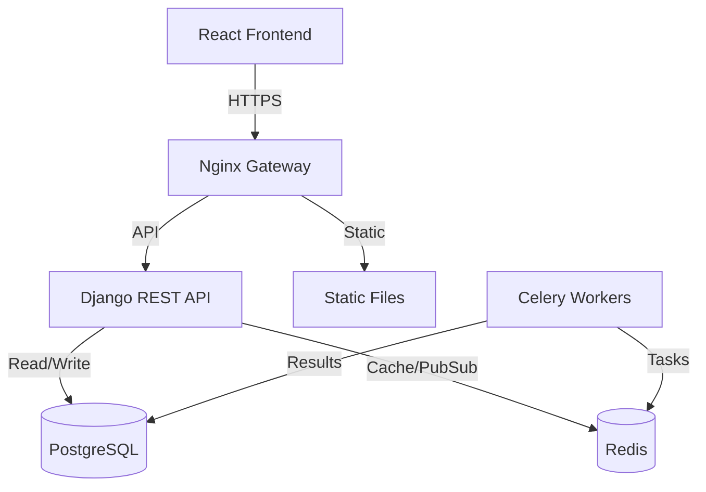

# P2P Procurement System

[](https://www.djangoproject.com/)
[](https://reactjs.org/)
[](https://www.typescriptlang.org/)
[](https://www.docker.com/)
[](LICENSE)

> **Enterprise-grade Procure-to-Pay (P2P) System** with intelligent document processing, multi-level approval workflows, and real-time analytics.

---

## 🚀 Quick Start

The fastest way to get started is using **Docker Compose**.

```bash
# 1. Clone the repository
git clone https://github.com/yourusername/p2p-procurement.git
cd p2p-procurement

# 2. Configure environment
cp .env.example .env

# 3. Start development environment
make dev
```

> **Access Points:**
>
> - **Frontend**: [http://localhost:3000](http://localhost:3000)
> - **Backend API**: [http://localhost:8000/api/](http://localhost:8000/api/)
> - **API Docs**: [http://localhost:8000/api/docs/](http://localhost:8000/api/docs/)

---

## 📚 Documentation

We maintain comprehensive documentation for engineers and architects:

- **[System Architecture](docs/ARCHITECTURE.md)** - Deep dive into the backend, frontend, and async worker design.
- **[API Reference](docs/API_REFERENCE.md)** - Complete REST API documentation with examples.
- **[Frontend Guide](docs/FRONTEND_GUIDE.md)** - Guide to the React/TypeScript architecture and state management.
- **[Deployment Guide](docs/DOCKER.md)** - Production deployment strategies.

---

## 🏗️ System Architecture

The system follows a **Modern Monolithic Architecture** designed for scalability and maintainability.



### Key Features

- **📝 Purchase Requests**: Create, track, and manage procurement requests with granular line items.
- **✅ Approval Workflows**: Configurable multi-level approval chains based on spending limits.
- **📄 Intelligent Processing**: Async document processing (OCR) for invoices and receipts using Celery.
- **⚡ Real-Time Updates**: Live dashboard updates via smart polling (React Query).
- **🔐 Enterprise Security**: HttpOnly cookie-based authentication, RBAC, and audit logging.

---

## 🛠️ Technology Stack

### Frontend

- **Core**: React 18, TypeScript, Vite
- **State**: TanStack Query (Server), Zustand (Client)
- **Styling**: Tailwind CSS
- **Forms**: React Hook Form + Zod

### Backend

- **Framework**: Django 4.2 + Django REST Framework
- **Database**: PostgreSQL 16
- **Async**: Celery 5 + Redis 7
- **Auth**: JWT (Dual-token strategy)

### Infrastructure

- **Containerization**: Docker & Docker Compose
- **Gateway**: Nginx
- **CI/CD**: GitHub Actions (Ready)

---

## 🔧 Development Commands

We use a `Makefile` to simplify common development tasks:

| Command         | Description                                   |
| --------------- | --------------------------------------------- |
| `make dev`      | Start the full development stack (Background) |
| `make dev-logs` | View real-time logs from all services         |
| `make migrate`  | Run database migrations                       |
| `make shell`    | Open a Django shell in the backend container  |
| `make test`     | Run backend test suite                        |
| `make clean`    | Stop containers and clean up resources        |

---

## 🤝 Contributing

Please read our [Contributing Guide](docs/CONTRIBUTING.md) before submitting a Pull Request.

1.  Fork the repo
2.  Create your feature branch (`git checkout -b feature/amazing-feature`)
3.  Commit your changes (`git commit -m 'Add amazing feature'`)
4.  Push to the branch (`git push origin feature/amazing-feature`)
5.  Open a Pull Request

---

## 📄 License

This project is licensed under the MIT License - see the [LICENSE](LICENSE) file for details.
