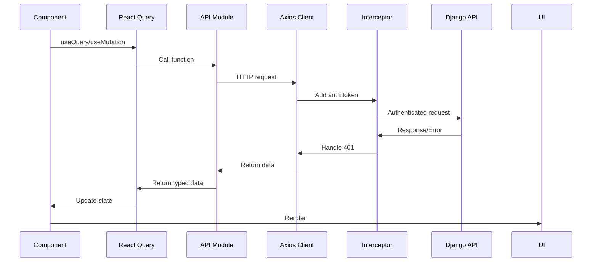

# API Integration Documentation

## Overview

This document details how the frontend integrates with the Django backend API, including endpoint mappings, request/response handling, and integration patterns.

## Backend API Endpoints

### Base URL
- **Development**: `http://localhost:8000/api`
- **Production**: `https://api.yourcompany.com/api`

---

## Authentication Endpoints

### POST `/auth/token/`
**Purpose**: User login

**Request**:
```json
{
  "username": "john.doe",
  "password": "securepassword123"
}
```

**Response** (200):
```json
{
  "access": "eyJ0eXAiOiJKV1QiLCJh...",
  "refresh": "eyJ0eXAiOiJKV1QiLCJh...",
  "user": {
    "id": "uuid",
    "username": "john.doe",
    "email": "john@company.com",
    "role": "staff"
  }
}
```

**Frontend Implementation**:
```typescript
// authApi.ts
login: async (credentials: LoginCredentials): Promise<AuthResponse> => {
  const response = await apiClient.post<AuthResponse>('/auth/token/', credentials);
  return response.data;
}
```

**Usage in Component**:
```typescript
const { login } = useAuthStore();
await login(username, password);
// Tokens auto-stored in localStorage
```

---

### POST `/auth/token/refresh/`
**Purpose**: Refresh access token

**Request**:
```json
{
  "refresh": "eyJ0eXAiOiJKV1QiLCJh..."
}
```

**Response** (200):
```json
{
  "access": "eyJ0eXAiOiJKV1QiLCJh..."
}
```

**Frontend Implementation**:
Handled automatically by Axios interceptor on 401 errors.

---

## Purchase Requests Endpoints

### GET `/purchases/requests/`
**Purpose**: List all purchase requests with filtering

**Query Parameters**:
- `status`: PENDING | APPROVED | REJECTED
- `search`: Text search
- `ordering`: Sort field (e.g., `-created_at`)
- `page`: Page number
- `page_size`: Items per page

**Response** (200):
```json
{
  "count": 25,
  "next": "http://localhost:8000/api/purchases/requests/?page=2",
  "previous": null,
  "results": [
    {
      "id": "uuid",
      "title": "Office Supplies Q4",
      "amount": "750.00",
      "status": "PENDING",
      "created_by": {...},
      "items": [...],
      "created_at": "2025-11-21T10:30:00Z"
    }
  ]
}
```

**Frontend Implementation**:
```typescript
// purchasesApi.ts
getRequests: async (params?: RequestQueryParams) => {
  const response = await apiClient.get<PaginatedResponse<PurchaseRequest>>(
    '/purchases/requests/', 
    { params }
  );
  return response.data;
}
```

**React Query Integration**:
```typescript
const { data, isLoading } = useQuery({
  queryKey: ['requests', statusFilter, searchQuery],
  queryFn: () => purchasesApi.getRequests({
    status: statusFilter || undefined,
    search: searchQuery || undefined,
  }),
});
```

---

### GET `/purchases/requests/:id/`
**Purpose**: Get single request details

**Response** (200):
```json
{
  "id": "uuid",
  "title": "Office Supplies Q4",
  "description": "...",
  "amount": "325.00",
  "status": "PENDING",
  "items": [...],
  "approvals": [...],
  "pending_approval_levels": [1],
  "is_fully_approved": false,
  "created_at": "2025-11-21T11:00:00Z"
}
```

**Frontend Implementation**:
```typescript
const { data: request } = useQuery({
  queryKey: ['request', id],
  queryFn: () => purchasesApi.getRequest(id!),
  enabled: !!id,
});
```

---

### POST `/purchases/requests/`
**Purpose**: Create new purchase request

**Request**:
```json
{
  "title": "Office Supplies Q4",
  "description": "Quarterly supplies",
  "items": [
    {
      "name": "Printer Paper A4",
      "quantity": 10,
      "unit_price": "25.00",
      "unit_of_measure": "reams"
    }
  ],
  "proforma_id": "uuid" // Optional
}
```

**Response** (201):
```json
{
  "message": "Purchase request created successfully",
  "request": {...}
}
```

**Frontend Implementation**:
```typescript
const createMutation = useMutation({
  mutationFn: (data: CreateRequestData) => purchasesApi.createRequest(data),
  onSuccess: (response) => {
    toast.success('Request created!');
    navigate(`/requests/${response.request.id}`);
  },
});
```

---

### POST `/purchases/requests/:id/approve/`
**Purpose**: Approve request at specific level

**Request**:
```json
{
  "level": 1,
  "comment": "Approved for procurement"
}
```

**Response** (200):
```json
{
  "message": "Request approved at level 1",
  "approval": {...},
  "request_status": "APPROVED",
  "is_fully_approved": true
}
```

**Frontend Implementation**:
```typescript
const approveMutation = useMutation({
  mutationFn: (data: ApprovalData) => purchasesApi.approveRequest(id!, data),
  onSuccess: () => {
    queryClient.invalidateQueries({ queryKey: ['request', id] });
    toast.success('Request approved!');
  },
});
```

---

### POST `/purchases/requests/:id/reject/`
**Purpose**: Reject request

**Request**:
```json
{
  "level": 1,
  "comment": "Budget constraints" // Required
}
```

**Response** (200):
```json
{
  "message": "Request rejected at level 1",
  "approval": {...},
  "request_status": "REJECTED"
}
```

---

## Purchase Orders Endpoints

### GET `/purchases/purchase-orders/`
**Purpose**: List purchase orders (Finance/Admin only)

**Query Parameters**:
- `status`: DRAFT | SENT | ACKNOWLEDGED | FULFILLED
- `search`: PO number or vendor
- `ordering`: Sort field

**Response**: Paginated list of POs

**Frontend Implementation**:
```typescript
const { data } = useQuery({
  queryKey: ['orders', statusFilter],
  queryFn: () => ordersApi.getOrders({ status: statusFilter }),
});
```

---

### GET `/purchases/purchase-orders/:id/`
**Purpose**: Get single PO details

**Response** (200):
```json
{
  "id": "uuid",
  "po_number": "PO-2025000001234",
  "vendor": "Acme Office Supplies",
  "total": "325.00",
  "status": "DRAFT",
  "metadata": {
    "items": [...],
    "terms": {...}
  },
  "request": {...}
}
```

---

### GET `/purchases/purchase-orders/:id/generate-pdf/`
**Purpose**: Generate PDF for PO

**Response** (200):
```json
{
  "message": "PDF generated successfully",
  "po_number": "PO-2025000001234"
}
```

**Frontend Implementation**:
```typescript
const generatePdfMutation = useMutation({
  mutationFn: () => ordersApi.generatePDF(id!),
  onSuccess: () => toast.success('PDF generated!'),
});
```

---

### GET `/purchases/purchase-orders/summary/`
**Purpose**: Get PO statistics

**Response** (200):
```json
{
  "total_pos": 45,
  "draft_pos": 12,
  "sent_pos": 18,
  "total_value": 125750.50
}
```

**Frontend Implementation**:
```typescript
const { data: poSummary } = useQuery({
  queryKey: ['po-summary'],
  queryFn: () => ordersApi.getSummary(),
  enabled: user?.role === 'finance',
});
```

---

## Error Handling

### Error Response Format

All API errors follow this format:
```json
{
  "error": {
    "code": "VALIDATION_ERROR",
    "message": "Request validation failed",
    "details": {
      "amount": ["Ensure this value is greater than 0.01"],
      "items": ["This field is required"]
    }
  }
}
```

### Frontend Error Handling

**Interceptor Level**:
```typescript
apiClient.interceptors.response.use(
  response => response,
  async error => {
    if (error.response?.status === 401) {
      // Auto-refresh token
    }
    return Promise.reject(error);
  }
);
```

**Component Level**:
```typescript
try {
  await purchasesApi.createRequest(data);
  toast.success('Success!');
} catch (error: any) {
  const message = error.response?.data?.error?.message || 'Failed';
  toast.error(message);
  
  // Field-level errors
  const details = error.response?.data?.error?.details;
  if (details) {
    Object.keys(details).forEach(field => {
      setError(field, { message: details[field][0] });
    });
  }
}
```

---

## Request/Response Flow

### Complete Request Flow



---

## Caching Strategy

### React Query Configuration

```typescript
const queryClient = new QueryClient({
  defaultOptions: {
    queries: {
      refetchOnWindowFocus: false,
      retry: 1,
      staleTime: 5 * 60 * 1000, // 5 minutes
    },
  },
});
```

### Cache Invalidation

**After Mutations**:
```typescript
onSuccess: () => {
  // Invalidate related queries
  queryClient.invalidateQueries({ queryKey: ['requests'] });
  queryClient.invalidateQueries({ queryKey: ['request', id] });
  queryClient.invalidateQueries({ queryKey: ['dashboard-requests'] });
}
```

**Manual Refetch**:
```typescript
const { refetch } = useQuery({...});
<Button onClick={() => refetch()}>Refresh</Button>
```

---

## Type Safety

All API calls are fully typed:

```typescript
// Request type
interface CreateRequestData {
  title: string;
  description: string;
  items: Omit<RequestItem, 'id' | 'line_total'>[];
  proforma_id?: string;
}

// Response type
interface APIResponse {
  message: string;
  request: PurchaseRequest;
}

// Typed API call
createRequest: async (data: CreateRequestData): Promise<APIResponse> => {
  const response = await apiClient.post<APIResponse>('/purchases/requests/', data);
  return response.data;
}
```

---

## Performance Optimizations

1. **Pagination**: Large lists use cursor pagination
2. **Caching**: 5-minute stale time reduces API calls
3. **Lazy Loading**: Pages loaded on demand
4. **Optimistic Updates**: UI updates before API confirmation
5. **Debounced Search**: Search waits for user to stop typing

---

## Authentication Flow

1. User logs in → Tokens stored in localStorage
2. Every request → Interceptor adds `Authorization: Bearer {token}`
3. Token expires → Interceptor catches 401
4. Auto-refresh → Get new access token
5. Retry → Original request succeeds
6. Refresh fails → Redirect to login

---

**Total Endpoints Integrated**: 12  
**Type Coverage**: 100%  
**Error Handling**: Comprehensive
