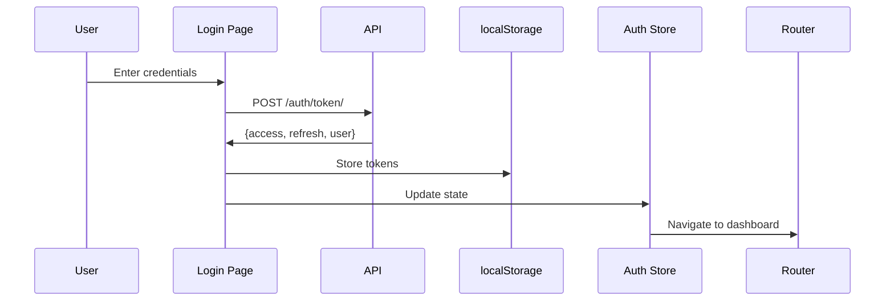
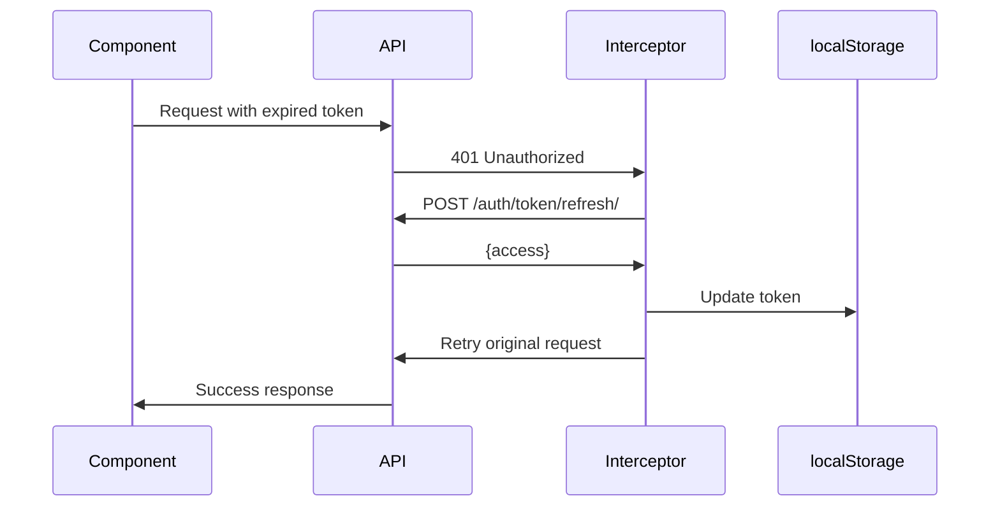
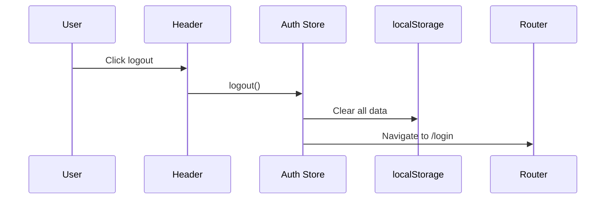

# Frontend Architecture Documentation

## Overview

The P2P Procurement frontend is a modern React + TypeScript application built with Vite, featuring role-based access control, real-time data synchronization, and a comprehensive UI for managing procurement workflows.

## Technology Stack

### Core Framework
- **React 18.2**: Modern hooks-based functional components
- **TypeScript 5.3**: Strict mode for type safety
- **Vite 5.0**: Fast build tool with HMR

### Styling
- **Tailwind CSS 3.3**: Utility-first CSS framework
- **Custom Design System**: Consistent colors, spacing, typography

### State Management
- **Zustand 4.4**: Global state (auth, UI)
- **React Query 5.12**: Server state management with caching
- **React Hook Form 7.48**: Form state and validation

### Routing & Navigation
- **React Router 6.20**: Client-side routing with lazy loading
- **Protected Routes**: Role-based access control

### HTTP & API
- **Axios 1.6**: HTTP client with interceptors
- **JWT Authentication**: Token-based auth with auto-refresh

### UI Components
- **React Toastify**: Toast notifications
- **Custom Components**: Reusable UI library

## Architecture Patterns

### Component Structure

```
Component Hierarchy:
App
├── QueryClientProvider (React Query)
├── BrowserRouter
├── ToastContainer
└── Routes
    ├── Login (public)
    └── Protected Routes
        ├── MainLayout
        │   ├── Header
        │   └── Page Content
        └── Pages
```

### Folder Organization

```
src/
├── api/                    # API integration layer
│   ├── client.ts          # Axios instance + interceptors
│   ├── authApi.ts         # Auth endpoints
│   ├── purchasesApi.ts    # Purchases endpoints
│   └── ordersApi.ts       # Orders endpoints
│
├── components/             # Reusable components
│   ├── common/            # Generic UI components
│   │   ├── Button.tsx
│   │   ├── Input.tsx
│   │   ├── Card.tsx
│   │   ├── Modal.tsx
│   │   ├── Spinner.tsx
│   │   └── StatusBadge.tsx
│   └── layout/            # Layout components
│       ├── Header.tsx
│       └── MainLayout.tsx
│
├── pages/                 # Route pages
│   ├── auth/
│   │   └── Login.tsx
│   ├── dashboard/
│   │   ├── Dashboard.tsx
│   │   └── StaffDashboard.tsx
│   ├── requests/
│   │   ├── RequestsList.tsx
│   │   ├── RequestDetail.tsx
│   │   └── CreateRequest.tsx
│   └── orders/
│       ├── OrdersList.tsx
│       └── OrderDetail.tsx
│
├── routes/                # Routing configuration
│   ├── index.tsx         # Route definitions
│   └── ProtectedRoute.tsx # Auth guard
│
├── store/                 # Global state
│   └── authStore.ts      # Zustand auth store
│
├── types/                 # TypeScript definitions
│   └── index.ts          # All type definitions
│
├── utils/                 # Utilities
│   ├── constants.ts      # App constants
│   └── formatters.ts     # Formatting functions
│
├── App.tsx               # Root component
├── main.tsx              # Entry point
└── index.css             # Global styles
```

## State Management Strategy

### Global State (Zustand)

**Auth Store** (`authStore.ts`):
```typescript
interface AuthState {
  user: User | null;
  isAuthenticated: boolean;
  isLoading: boolean;
  login: (username, password) => Promise<void>;
  logout: () => void;
  checkAuth: () => void;
}
```

**Usage**:
- User authentication status
- User profile data
- Login/logout actions
- Token management

### Server State (React Query)

**Query Keys**:
- `['requests', filters]` - Purchase requests
- `['request', id]` - Single request
- `['orders', filters]` - Purchase orders
- `['order', id]` - Single order
- `['dashboard-requests']` - Dashboard data
- `['po-summary']` - PO statistics

**Configuration**:
```typescript
{
  refetchOnWindowFocus: false,
  retry: 1,
  staleTime: 5 * 60 * 1000, // 5 minutes
}
```

**Benefits**:
- Automatic caching
- Background refetching
- Optimistic updates
- Loading/error states

### Local State (useState/useReducer)

Used for:
- Form inputs
- Modal visibility
- UI toggles
- Temporary data

## API Integration

### Axios Client Configuration

**Base Setup**:
```typescript
const apiClient = axios.create({
  baseURL: 'http://localhost:8000/api',
  headers: { 'Content-Type': 'application/json' }
});
```

**Request Interceptor**:
- Injects JWT access token
- Adds authorization header

**Response Interceptor**:
- Detects 401 errors
- Automatically refreshes token
- Retries failed requests
- Redirects to login on failure

### API Modules

**authApi.ts**:
- `login(credentials)` - Authenticate user
- `refreshToken(token)` - Refresh access token
- `getCurrentUser()` - Get user profile

**purchasesApi.ts**:
- `getRequests(params)` - List requests
- `getRequest(id)` - Get single request
- `createRequest(data)` - Create request
- `updateRequest(id, data)` - Update request
- `approveRequest(id, data)` - Approve
- `rejectRequest(id, data)` - Reject

**ordersApi.ts**:
- `getOrders(params)` - List orders
- `getOrder(id)` - Get single order
- `generatePDF(id)` - Generate PO PDF
- `getSummary()` - Get statistics

## Routing Architecture

### Route Structure

```typescript
/                       → Redirect to /dashboard
/login                  → Login page (public)
/dashboard              → Role-based dashboard (protected)
/requests               → Requests list (protected)
/requests/create        → Create request (staff/admin)
/requests/:id           → Request detail (protected)
/orders                 → Orders list (finance/admin)
/orders/:id             → Order detail (finance/admin)
```

### Protected Routes

**Implementation**:
```typescript
<ProtectedRoute roles={['finance', 'admin']}>
  <OrdersList />
</ProtectedRoute>
```

**Logic**:
1. Check if user is authenticated
2. Check if user has required role
3. Redirect to login or dashboard if unauthorized

### Lazy Loading

All pages are lazy-loaded for code splitting:
```typescript
const Dashboard = React.lazy(() => import('@/pages/dashboard/Dashboard'));
```

**Benefits**:
- Smaller initial bundle
- Faster load times
- Better performance

## Authentication Flow

### Login Sequence



### Token Refresh Flow



### Logout Flow



## Design System

### Colors

```css
Primary: Indigo
  - 600: #4f46e5 (main)
  - 700: #4338ca (hover)

Status Colors:
  - Pending: Yellow (#fbbf24)
  - Approved: Green (#10b981)
  - Rejected: Red (#ef4444)
```

### Typography

- **Font Family**: Inter
- **Sizes**: sm (0.875rem), base (1rem), lg (1.125rem), xl-3xl for headings

### Spacing

Following Tailwind's 4px-based scale:
- Tight: 4px, 8px
- Normal: 16px, 24px
- Loose: 32px, 48px

### Components

All components follow consistent patterns:
- Proper TypeScript typing
- Forwarded refs where needed
- Accessible markup
- Tailwind utilities

## Performance Optimizations

### Code Splitting
- Lazy-loaded route components
- Dynamic imports for heavy dependencies

### Caching
- React Query caches API responses
- 5-minute stale time for most queries

### Memoization
- Avoid unnecessary re-renders
- Use React.memo for expensive components

### Bundle Size
- Tree-shaking enabled
- Production builds minified
- Vite optimization

## Security Considerations

### Authentication
- JWT tokens stored in localStorage
- Auto-refresh prevents expired sessions
- Secure token transmission

### Authorization
- Role-based route protection
- API-level permission checks
- UI elements hidden based on roles

### XSS Prevention
- React auto-escapes content
- No dangerouslySetInnerHTML
- Sanitized user inputs

### CSRF Protection
- Token-based auth (no cookies)
- Same-origin policy enforced

## Error Handling

### API Errors
- Interceptor catches all API errors
- Toast notifications for user feedback
- Field-level validation errors

### Network Errors
- Retry logic in React Query
- Loading states during requests
- Error boundaries for crashes

### Form Validation
- React Hook Form validation
- Real-time error display
- Custom validation rules

## Browser Support

- Modern browsers (Chrome, Firefox, Safari, Edge)
- ES2020+ features
- No IE11 support

## Build & Deployment

### Development
```bash
npm run dev  # Port 3000 with HMR
```

### Production
```bash
npm run build  # Creates dist/ folder
```

### Environment Variables
```
VITE_API_BASE_URL - Backend API URL
```

---

**Version**: 1.0  
**Last Updated**: 2025-11-21
