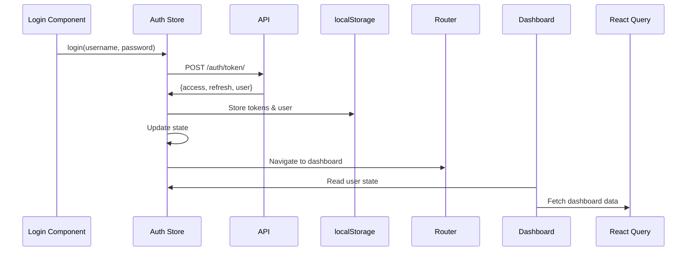
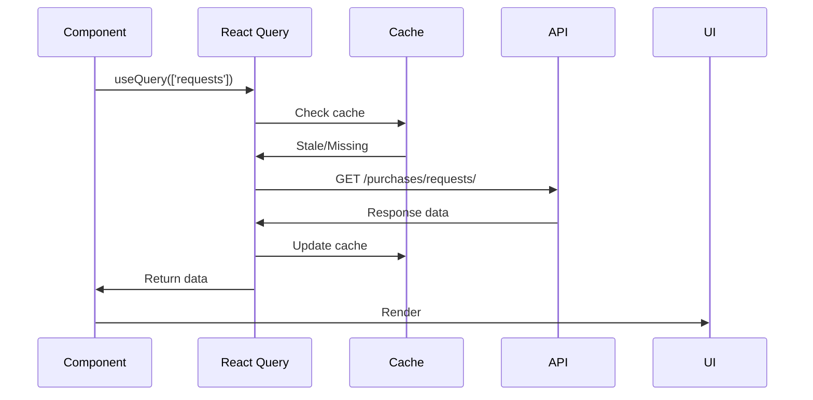
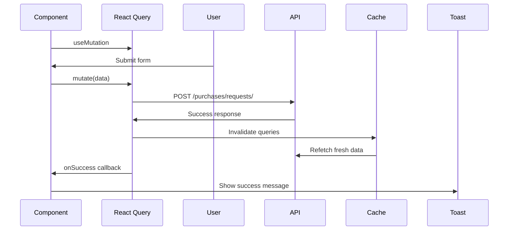

# State Management Documentation

## Overview

The frontend uses a hybrid state management approach combining Zustand for global state and React Query for server state, with local component state for UI-specific needs.

---

## Architecture

```
State Management Layers:
┌─────────────────────────────────────┐
│     Local State (useState)          │
│  - Form inputs, UI toggles          │
└─────────────────────────────────────┘
           ↓
┌─────────────────────────────────────┐
│   Global State (Zustand)            │
│  - Auth, user, UI preferences       │
└─────────────────────────────────────┘
           ↓
┌─────────────────────────────────────┐
│   Server State (React Query)        │
│  - API data, caching, sync          │
└─────────────────────────────────────┘
```

---

## Global State (Zustand)

### Auth Store

**Location**: `src/store/authStore.ts`

**Purpose**: Manage authentication state across the application

**State Shape**:
```typescript
interface AuthState {
  user: User | null;
  isAuthenticated: boolean;
  isLoading: boolean;
  error: string | null;
  login: (username: string, password: string) => Promise<void>;
  logout: () => void;
  checkAuth: () => void;
}
```

**Implementation**:
```typescript
export const useAuthStore = create<AuthState>((set) => ({
  user: null,
  isAuthenticated: false,
  isLoading: false,
  error: null,

  login: async (username, password) => {
    set({ isLoading: true, error: null });
    try {
      const response = await authApi.login({ username, password });
      localStorage.setItem('access_token', response.access);
      localStorage.setItem('refresh_token', response.refresh);
      localStorage.setItem('user', JSON.stringify(response.user));
      
      set({
        user: response.user,
        isAuthenticated: true,
        isLoading: false,
      });
    } catch (error: any) {
      set({
        error: error.response?.data?.error?.message || 'Login failed',
        isLoading: false,
      });
      throw error;
    }
  },

  logout: () => {
    localStorage.clear();
    set({ user: null, isAuthenticated: false });
  },

  checkAuth: () => {
    const token = localStorage.getItem('access_token');
    const userStr = localStorage.getItem('user');
    
    if (token && userStr) {
      const user = JSON.parse(userStr);
      set({ user, isAuthenticated: true });
    }
  },
}));
```

**Usage in Components**:
```typescript
// Read state
const { user, isAuthenticated } = useAuthStore();

// Call actions
const { login, logout } = useAuthStore();
await login(username, password);

// Conditional rendering
{isAuthenticated && <Dashboard />}
```

**Why Zustand?**
- ✅ Minimal boilerplate
- ✅ No provider wrappers
- ✅ TypeScript friendly
- ✅ DevTools support
- ✅ Tiny bundle size (1KB)

---

## Server State (React Query)

### Configuration

**Location**: `src/App.tsx`

```typescript
const queryClient = new QueryClient({
  defaultOptions: {
    queries: {
      refetchOnWindowFocus: false,
      retry: 1,
      staleTime: 5 * 60 * 1000, // 5 minutes
    },
  },
});
```

### Query Keys Strategy

**Naming Convention**:
```typescript
// List queries
['requests', filters] // All requests with filters
['orders', filters]   // All orders with filters

// Detail queries
['request', id]       // Single request
['order', id]         // Single order

// Aggregates
['dashboard-requests'] // Dashboard data
['po-summary']        // PO statistics
```

**Benefits**:
- Automatic cache invalidation
- Easy to target related queries
- Consistent naming

### Queries (Data Fetching)

**Basic Query**:
```typescript
const { data, isLoading, error } = useQuery({
  queryKey: ['requests', statusFilter],
  queryFn: () => purchasesApi.getRequests({ status: statusFilter }),
});
```

**Conditional Query**:
```typescript
const { data: request } = useQuery({
  queryKey: ['request', id],
  queryFn: () => purchasesApi.getRequest(id!),
  enabled: !!id, // Only run if id exists
});
```

**Role-Based Query**:
```typescript
const { data: poSummary } = useQuery({
  queryKey: ['po-summary'],
  queryFn: () => ordersApi.getSummary(),
  enabled: user?.role === 'finance' || user?.role === 'admin',
});
```

### Mutations (Data Updates)

**Create Mutation**:
```typescript
const createMutation = useMutation({
  mutationFn: (data: CreateRequestData) => purchasesApi.createRequest(data),
  onSuccess: (response) => {
    // Invalidate queries to refetch fresh data
    queryClient.invalidateQueries({ queryKey: ['requests'] });
    
    // Navigate to new resource
    navigate(`/requests/${response.request.id}`);
    
    // User feedback
    toast.success('Request created successfully!');
  },
  onError: (error: any) => {
    toast.error(error.response?.data?.error?.message || 'Failed');
  },
});

// Usage
createMutation.mutate(formData);
```

**Update Mutation**:
```typescript
const approveMutation = useMutation({
  mutationFn: (data: ApprovalData) => purchasesApi.approveRequest(id!, data),
  onSuccess: () => {
    // Invalidate specific request
    queryClient.invalidateQueries({ queryKey: ['request', id] });
    
    // Also invalidate lists
    queryClient.invalidateQueries({ queryKey: ['requests'] });
    queryClient.invalidateQueries({ queryKey: ['dashboard-requests'] });
    
    toast.success('Request approved!');
  },
});
```

### Cache Invalidation Patterns

**After Create**:
```typescript
onSuccess: () => {
  queryClient.invalidateQueries({ queryKey: ['requests'] });
}
```

**After Update**:
```typescript
onSuccess: () => {
  queryClient.invalidateQueries({ queryKey: ['request', id] });
  queryClient.invalidateQueries({ queryKey: ['requests'] });
}
```

**After Delete**:
```typescript
onSuccess: () => {
  queryClient.invalidateQueries({ queryKey: ['requests'] });
  navigate('/requests');
}
```

**Manual Refetch**:
```typescript
const { refetch } = useQuery({...});
<Button onClick={() => refetch()}>Refresh</Button>
```

---

## Local Component State

### Form State (React Hook Form)

**Example**:
```typescript
const { register, handleSubmit, formState: { errors } } = useForm<FormData>();

<Input
  label="Title"
  {...register('title', { required: 'Title is required' })}
  error={errors.title?.message}
/>
```

**Field Array**:
```typescript
const { fields, append, remove } = useFieldArray({
  control,
  name: 'items',
});

{fields.map((field, index) => (
  <div key={field.id}>
    <Input {...register(`items.${index}.name`)} />
    <button onClick={() => remove(index)}>Remove</button>
  </div>
))}
```

### UI State (useState)

**Modal Visibility**:
```typescript
const [showModal, setShowModal] = useState(false);

<Modal 
  isOpen={showModal} 
  onClose={() => setShowModal(false)}
>
  ...
</Modal>
```

**Filter State**:
```typescript
const [statusFilter, setStatusFilter] = useState<RequestStatus | ''>('');
const [searchQuery, setSearchQuery] = useState('');

<select value={statusFilter} onChange={(e) => setStatusFilter(e.target.value)}>
  <option value="">All</option>
  <option value="PENDING">Pending</option>
</select>
```

---

## State Flow Diagrams

### Login Flow



### Data Fetch Flow



### Mutation Flow



---

## Best Practices

### 1. Separation of Concerns

- **Global State**: Auth, user preferences
- **Server State**: API data
- **Local State**: UI, forms

### 2. Query Key Consistency

Always use the same key structure:
```typescript
['resource', filters] // Lists
['resource', id]      // Details
```

### 3. Invalidation Strategy

Invalidate related queries after mutations:
```typescript
queryClient.invalidateQueries({ queryKey: ['requests'] });
queryClient.invalidateQueries({ queryKey: ['request', id] });
```

### 4. Loading States

Always handle loading and error states:
```typescript
if (isLoading) return <Spinner />;
if (error) return <ErrorMessage />;
return <Content data={data} />;
```

### 5. Optimistic Updates

For instant UI feedback:
```typescript
onMutate: async (newData) => {
  // Cancel outgoing refetches
  await queryClient.cancelQueries({ queryKey: ['requests'] });
  
  // Snapshot previous value
  const previous = queryClient.getQueryData(['requests']);
  
  // Optimistically update
  queryClient.setQueryData(['requests'], old => [...old, newData]);
  
  return { previous };
},
onError: (err, newData, context) => {
  // Rollback on error
  queryClient.setQueryData(['requests'], context.previous);
},
```

---

## State Persistence

### LocalStorage

Currently stored:
- `access_token`: JWT access token
- `refresh_token`: JWT refresh token
- `user`: User object (JSON)

**On App Load**:
```typescript
useEffect(() => {
  checkAuth(); // Restore from localStorage
}, []);
```

**On Logout**:
```typescript
logout: () => {
  localStorage.clear();
  set({ user: null, isAuthenticated: false });
}
```

---

## Performance Considerations

1. **Stale Time**: 5-minute cache prevents unnecessary refetches
2. **No Window Refocus**: Disabled to prevent constant refetching
3. **Retry Once**: Failed queries retry once only
4. **Lazy Loading**: Pages loaded on demand
5. **Selective Invalidation**: Only invalidate affected queries

---

**State Layers**: 3 (Local, Global, Server)  
**Global Stores**: 1 (Auth)  
**Query Keys**: 6 patterns  
**Cache Strategy**: Time-based + invalidation
