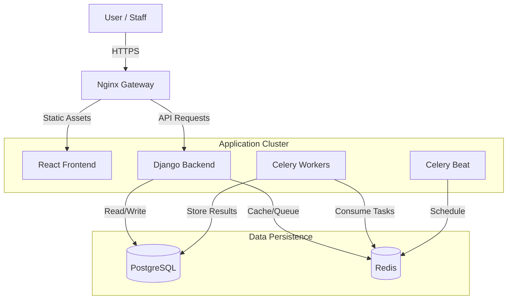

# System Architecture

> **P2P Procurement System** - Technical Architecture Document
> _Version 2.1 | Last Updated: November 2025_

This document provides a deep technical deep-dive into the P2P Procurement System. It is intended for software engineers, architects, and DevOps professionals who need to understand the system's internal workings, design patterns, and scalability strategies.

---

## 1. High-Level Design

The system follows a **Modern Monolithic Architecture** with a clear separation of concerns between the frontend (SPA) and backend (API). It leverages containerization for consistency across environments and uses asynchronous processing for heavy workloads.

### 1.1 System Context Diagram

### 1.2 Core Components

| Component         | Technology           | Responsibility                                      |
| ----------------- | -------------------- | --------------------------------------------------- |
| **Frontend**      | React 18, TypeScript | User Interface, Client-side logic, State Management |
| **Backend**       | Django 4.2, DRF      | REST API, Business Logic, Auth, Data Validation     |
| **Database**      | PostgreSQL 16        | Persistent relational data storage                  |
| **Cache/Broker**  | Redis 7              | Session storage, API caching, Celery message broker |
| **Async Workers** | Celery 5             | Background task processing (OCR, Emails, Reports)   |
| **Gateway**       | Nginx                | Reverse proxy, SSL termination, Static file serving |

---

## 2. Backend Architecture

The backend is built on **Django** and **Django REST Framework (DRF)**, adhering to **Domain-Driven Design (DDD)** principles where possible within the Django framework.

### 2.1 Domain Modules

The codebase is organized by business domains rather than technical layers:

- **`users/`**: Identity and Access Management (IAM). Handles authentication, user profiles, and role-based permissions.
- **`purchases/`**: Core procurement logic. Purchase Requests (PR), Purchase Orders (PO), and Approval Workflows.
- **`documents/`**: File management. Uploads, OCR processing, and storage.
- **`core/`**: Shared utilities, middleware, and base classes.

### 2.2 Service Layer Pattern

We use a "Service Layer" to encapsulate business logic, keeping Views (Controllers) thin and Models focused on data structure.

**Example: Purchase Request Creation**

1.  **View**: Receives HTTP POST, validates input via Serializer.
2.  **Service**: `PurchaseRequestService.create_request()`
    - Checks user spending limits.
    - Creates the `PurchaseRequest` record.
    - Triggers the `ApprovalService` to assign the correct approver.
    - Queues a notification task.
3.  **Model**: Saves data to PostgreSQL.

### 2.3 Authentication & Security

- **Mechanism**: JWT (JSON Web Tokens) with a dual-token strategy (Access + Refresh).
- **Storage**: **HttpOnly, Secure Cookies**. We do _not_ store tokens in LocalStorage to prevent XSS attacks.
- **CSRF**: Standard Django CSRF protection is enabled for non-safe methods.
- **Permissions**: Granular `IsAuthenticated`, `IsAdminUser`, and custom `IsApprover` permission classes.

---

## 3. Frontend Architecture

The frontend is a **Single Page Application (SPA)** built with **React** and **TypeScript**, emphasizing type safety and component reusability.

### 3.1 Key Technologies

- **Build Tool**: Vite (Fast HMR and optimized builds).
- **Styling**: Tailwind CSS (Utility-first styling).
- **Server State**: TanStack Query (React Query) v5. Handles caching, polling, and synchronization.
- **Client State**: Zustand. Lightweight global state for UI (sidebar, modals, auth status).
- **Forms**: React Hook Form + Zod (Schema validation).

### 3.2 Real-Time Updates (Polling Strategy)

Instead of complex WebSockets (which add operational overhead), we use **Smart Polling** via React Query for real-time updates.

- **Dashboard**: Polls every 10-15 seconds for stats and new requests.
- **Task Progress**: When a document is uploaded, the UI polls the specific Task ID every 2 seconds until completion (`PENDING` -> `SUCCESS`).
- **Optimization**: Polling pauses when the window loses focus (except for critical tasks).

---

## 4. Asynchronous Task Processing

Heavy operations are offloaded to **Celery** workers to ensure the API remains responsive.

### 4.1 Task Flow: Document Processing

1.  **Upload**: User uploads a PDF via `POST /api/documents/upload/`.
2.  **Queue**: Backend saves the file and queues a `process_document` task in Redis.
3.  **Response**: API returns `202 Accepted` with a `task_id`.
4.  **Processing**:
    - Celery Worker picks up the task.
    - Performs OCR (Text Extraction).
    - Updates the `Document` model with extracted data.
    - Sets status to `COMPLETED`.
5.  **Feedback**: Frontend polls `GET /api/tasks/{task_id}/` and updates the progress bar.

### 4.2 Scheduled Tasks (Celery Beat)

- **Daily**: Generate spending reports.
- **Weekly**: Cleanup temporary files.
- **Monthly**: Archive old purchase orders.

---

## 5. Deployment & Infrastructure

The system is fully containerized using **Docker** and orchestrated via **Docker Compose**.

### 5.1 Environment Strategy

- **Development (`docker-compose.yml`)**:

  - Hot-reloading for Frontend (Vite) and Backend (Django).
  - Exposed ports for debugging (DB: 5432, Redis: 6379).
  - Verbose logging.

- **Production (`docker-compose.prod.yml`)**:
  - **Nginx**: Serves as the single entry point (Gateway).
  - **Gunicorn**: Production WSGI server for Django.
  - **Optimization**: React app is built to static files and served by Nginx.
  - **Security**: Database and Redis ports are _not_ exposed to the host. Internal Docker network only.

### 5.2 Scalability

- **Horizontal Scaling**: The stateless backend and Celery workers can be scaled by increasing the replica count in Docker Swarm or Kubernetes.
- **Database**: Read replicas can be added for read-heavy workloads.
- **Caching**: Redis handles high-throughput caching to reduce DB load.

---

## 6. Key Engineering Decisions

| Decision                  | Rationale                                                                                                                                   |
| ------------------------- | ------------------------------------------------------------------------------------------------------------------------------------------- |
| **HttpOnly Cookies**      | Chosen over LocalStorage for JWTs to mitigate XSS vulnerabilities.                                                                          |
| **Polling vs WebSockets** | Polling is simpler to implement, easier to scale (stateless), and sufficient for the required update frequency (seconds, not milliseconds). |
| **Tailwind CSS**          | Speeds up development and ensures design consistency without context-switching to CSS files.                                                |
| **Makefiles**             | Provides a unified, platform-agnostic interface for common devops commands (`make dev`, `make deploy`).                                     |

---

## 7. Future Roadmap

- **Microservices**: Extract `Document Service` into a standalone service if OCR load increases significantly.
- **Event Sourcing**: Implement Kafka/RabbitMQ for more complex event-driven workflows.
- **Mobile App**: Build a React Native app reusing the existing API and hooks.
